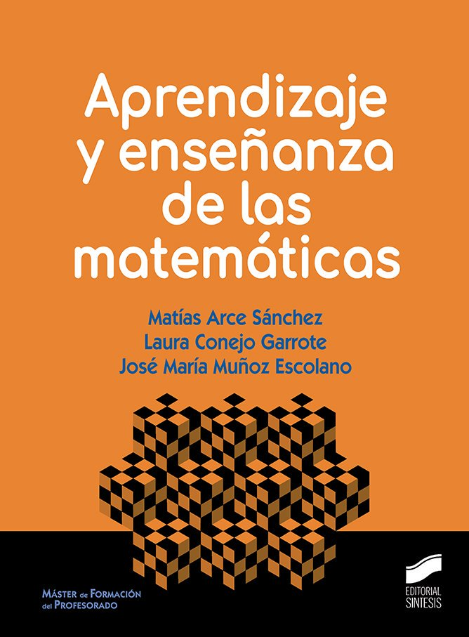
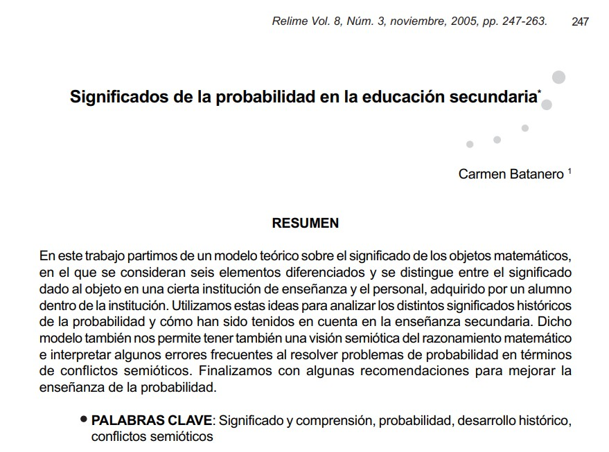
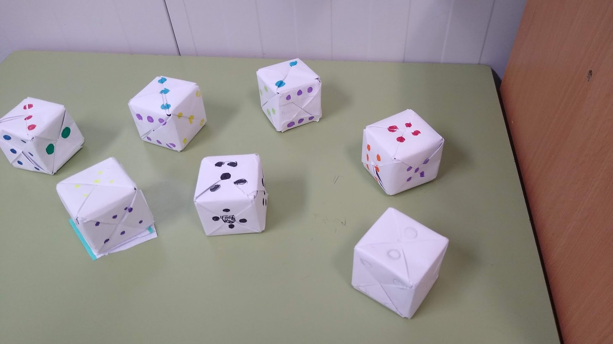
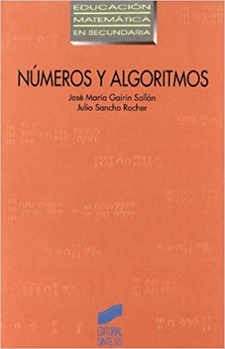

# Acceso a la presentación {data-background-image="assets/art/pc.jpg" data-background-opacity="0.25"}

## {data-background-image="assets/art/pc.jpg" data-background-opacity="0.18"}

{width=50%}

[https://pbeltran.github.io/investigacion-practica-ene2020](https://pbeltran.github.io/investigacion-practica-ene2020)

# Un acercamiento al área de didáctica de las matemáticas {data-background-image="assets/art/belinda-fewings-unsplash.jpg" data-background-opacity="0.20"}

## ¿Innovación? ¿Qué es innovación?

:::::::::::::: {.columns}

::: {.column width="45%"}

{width=80%}

:::

::: {.column width="45%"}

[Bipolaridad tuitera](https://twitter.com/pbeltranp/status/1093987718051319814)

Entre el mundo de los congresos de "innovación" chorras (ojo comillas), normalmente auspiciados por bancos y tecnológicas, y el de los que detestan todo lo que huela a pedagogía o didáctica (disciplinas que no suelen distinguir), hay todo un universo por explorar.

:::
:::::::::::::

## ¿Una revelación?

{width=100%}

## Carácter prescriptivo de la didáctica {data-background-image="assets/art/belinda-fewings-unsplash.jpg" data-background-opacity="0.20"}

> ¿Hasta qué punto, en qué forma y en qué condiciones, la didáctica puede (o incluso debe) proponer juicios valorativos y normativos que proporcionen criterios sobre cómo organizar y gestionar los procesos de estudio? (p. 26)

Gascón & Nicolás (2017). 

## Conocimientos y competencias del profesor de matemáticas {data-background-image="assets/art/belinda-fewings-unsplash.jpg" data-background-opacity="0.20"}

{width=75%}

Fuente: Godino, Batanero, Font, & Giacomone (2016). 

## Idoneidad didáctica {data-background-image="assets/art/belinda-fewings-unsplash.jpg" data-background-opacity="0.20"}

{width=65%}

Fuente: Godino (2013).

## Dominio afectivo {data-background-image="assets/art/belinda-fewings-unsplash.jpg" data-background-opacity="0.20"}

:::::::::::::: {.columns}

::: {.column width="45%"}

- Emociones.
- Actitudes.
- Creencias.
- Valores.

{width=70%}

:::

::: {.column width="45%"}

> De profesores y alumnos.

- Hacia las matemáticas.
- Hacia su enseñanza.
- Etc. 

:small_blue_diamond::small_blue_diamond::small_blue_diamond:

No hay una única manera de enseñar "bien" las matemáticas.

:::
:::::::::::::

## Diversidad de significados {data-background-image="assets/art/belinda-fewings-unsplash.jpg" data-background-opacity="0.20"}

:::::::::::::: {.columns}

::: {.column width="45%"}

{width=100%}

:::

::: {.column width="45%"}

Los vídeos analizados mostraron **diversidad de significados** e **idoneidades didácticas (epistémicas)** dispares. Los más populares no siempre son los más idóneos.

:::
:::::::::::::

Beltrán-Pellicer, P., Giacomone, B., & Burgos, M. (2018). 

[Enlace al hilo con los highlights](https://twitter.com/pbeltranp/status/1068594452133003264)

:bulb::bulb::bulb:

Una actividad similar la planteamos como taller en el máster.

## Valorar "metodologías" {data-background-image="assets/art/belinda-fewings-unsplash.jpg" data-background-opacity="0.20"}

:::::::::::::: {.columns}

::: {.column width="45%"}

> Flipped classroom

Lo que se hace no es invertir nada, sino desplazar. Es dar la **teoría** en casa. Y son deberes.

:::

::: {.column width="45%"}

> Gamificación 

No es lo mismo que el uso de juegos como recurso didáctico.

:::
:::::::::::::

## Valorar referencias {data-background-image="assets/images/paradigmapatata.jpg" data-background-opacity="0.24"}

:::::::::::::: {.columns}

::: {.column width="20%"}

{width=100%}

:::

::: {.column width="40%"}

{width=90%}

:::

::: {.column width="40%"}

{width=90%}

:::
:::::::::::::

Evidencia: ¿qué evidencia?

:::::::::::::: {.columns}

::: {.column width="45%"}

{width=100%}

:::

::: {.column width="45%"}

{width=40%}

[A reply to Mr. Barton, de Andrew Blair](http://www.inquirymaths.com/posts/areplytomrbarton)

:::
:::::::::::::

## Útil para algunos, poco útil para otros {data-background-image="assets/art/belinda-fewings-unsplash.jpg" data-background-opacity="0.20"}

{width=90%}

Esto es una **ciencia social**. Si esto va de aprendizaje, ¿qué queremos que aprenda nuestro alumnado? 

:small_blue_diamond::small_blue_diamond::small_blue_diamond:

La **respuesta** no tiene solución única. El **cómo**, tampoco.

## Enseñanza y aprendizaje de contenidos concretos {data-background-image="assets/art/belinda-fewings-unsplash.jpg" data-background-opacity="0.20"}

:::::::::::::: {.columns}

::: {.column width="45%"}

{width=60%}

{width=60%}

:::

::: {.column width="45%"}

{width=50%}

{width=50%}

:::
:::::::::::::

## Para una visión del área de didática de las matemáticas

> Una opción puede ser empezar por esto de aquí (secundaria)

{width=30%}

_Aprendizaje y enseñanza de las matemáticas_ (Arce, Conejo y Muñoz, 2019). 

# A través de la resolución de problemas {data-background-image="assets/art/clase.jpg" data-background-opacity="0.2"}

## Matemáticas sin pizarra {data-background-image="assets/art/clase.jpg" data-background-opacity="0.2"}

:::::::::::::: {.columns}

::: {.column width="45%"}
{width=100%}
:::

::: {.column width="45%"}

El librito es de 1986. Mismas preocupaciones que ahora.

{width=100%}

:::
:::::::::::::

## Matemáticas sin pizarra {data-background-image="assets/art/clase.jpg" data-background-opacity="0.2"}

> El prólogo expone las razones que llevaron a prepararlo.

- Contenidos de 1º BUP (3º ESO) excesivamente teóricos y sin relación con los intereses vitales del alumnado.
- Las clases se basan casi exclusivamente en explicaciones del profesor. 

. . .

:see_no_evil: :hear_no_evil: :speak_no_evil:

Fomenta actitudes pasivas en los alumnos, que pasan más tiempo _viendo hacer_ que _haciendo_. Imitando.

:see_no_evil: :hear_no_evil: :speak_no_evil:

## Matemáticas sin pizarra {data-background-image="assets/art/clase.jpg" data-background-opacity="0.2"}

> El profesor **protege** excesivamente al alumnado. 

- Explica con detalle el libro de texto, inhibiendo la competencia lectora del alumno. 
- Dice cómo se tienen que resolver los ejercicios.
- Avisa de los errores que no se deben cometer.
- Resuelve dudas y preguntas antes de que ellos se las planteen.
- El alumno no desarrolla capacidad de crítica y evaluación de su trabajo, pues el profesor siempre decide lo que está bien y lo que está mal.

:scroll: Contrato didáctico "clásico" :scroll:

## Matemáticas sin pizarra {data-background-image="assets/art/clase.jpg" data-background-opacity="0.2"}

- Separación artificial entre la teoría y los ejercicios.
- Apenas se realizan problemas de verdad.

:question::question::question:

> ¿Qué es un problema?

- Enseñar **para** resolver problemas.
- Enseñar **a través** de la resolución de problemas. 
- Enseñar **sobre** resolución de problemas.

## Educación inclusiva {data-background-image="assets/art/clase.jpg" data-background-opacity="0.2"}

{width=100%}

## ¿Qué pasa si vas con un enfoque a través de la resolución de problemas a una clase acostumbrada a otra cosa? {data-background-image="assets/art/clase.jpg" data-background-opacity="0.2"}

{width=70%}

El gif es gracioso, pero un poco exagerado.

## Las tareas no son teacher-proofed {data-background-image="assets/art/clase.jpg" data-background-opacity="0.2"}

{width=90%}

## Coherencia incansable (relentless consistency) {data-background-image="assets/art/clase.jpg" data-background-opacity="0.2"}

> La cultura de aula importa (contrato didáctico).

Es común encontrar resistencia cuando el enfoque que plantea el docente es a través de la RP y la cultura de aula es todo lo contrario. ¿Qué hacer? 

> Relentless consistency (¿coherencia incansable?) Brown y Coles (2013) :muscle:

## Uso del cuaderno {data-background-image="assets/art/kidwriting.jpg" data-background-opacity="0.2"}

:::::::::::::: {.columns}

::: {.column width="45%"}
{width=100%}

[Enlace al vídeo](https://www.youtube.com/watch?v=Su66IdciZfg)
:::

::: {.column width="45%"}

- Espacio público. 
- Espacio privado.

:small_blue_diamond::small_blue_diamond::small_blue_diamond:

:white_check_mark: ¿Cómo lo evaluamos? 

[Exámenes de cuaderno](https://tierradenumeros.com/post/examen-de-cuaderno/)

:::
:::::::::::::

## WODB {data-background-image="assets/images/wodb.jpg" data-background-opacity="0.2"}

{width=70%}

[wodb.ca](http://wodb.ca/)

# Contenidos concretos {data-background-image="assets/images/medida2.jpg" data-background-opacity="0.2"}

## Probabilidad {data-background-image="assets/images/prob1.jpg" data-background-opacity="0.2"}

:::::::::::::: {.columns}

::: {.column width="45%"}

{width=80%}  

:::

::: {.column width="45%"}

{width=100%}  

Batanero (2005).

:::
:::::::::::::

## Probabilidad {data-background-image="assets/images/prob1.jpg" data-background-opacity="0.2"}

:::::::::::::: {.columns}

::: {.column width="45%"}

{width=100%}  

:::

::: {.column width="45%"}

{width=100%}  

:::
:::::::::::::

## Probabilidad {data-background-image="assets/images/prob1.jpg" data-background-opacity="0.2"}

{width=100%}  

## Probabilidad {data-background-image="assets/images/prob1.jpg" data-background-opacity="0.2"}

{width=100%}  

[Enlace al hilo completo](https://twitter.com/pbeltranp/status/1185842437215916032)

## Estadística {data-background-image="assets/images/basket.jpg" data-background-opacity="0.14"}

:::::::::::::: {.columns}

::: {.column width="45%"}

Partido de basket. Queda un minuto y el entrenador tiene que decidir a qué jugadora sacar. ¿A quién elegirá?

- Si va perdiendo de 8 puntos.
- Si va ganando de 2 puntos.

:::

::: {.column width="45%"}

{width=100%}  

{width=80%}  

:::
:::::::::::::
 
## Estadística {data-background-image="assets/images/basket.jpg" data-background-opacity="0.14"}

{width=80%}  
 
[Enlace a la secuencia](https://tierradenumeros.com/post/hilo-medidas-de-dispersion/)

## Números {data-background-image="assets/images/contar2.jpg" data-background-opacity="0.2"}

:::::::::::::: {.columns}

::: {.column width="45%"}
{width=100%}

[Enlace al vídeo](https://www.youtube.com/watch?v=E2UeSjGM-Aw)
:::

::: {.column width="45%"}

{width=100%}

:::
:::::::::::::

## Números {data-background-image="assets/images/contar2.jpg" data-background-opacity="0.2"}

:::::::::::::: {.columns}

::: {.column width="35%"}
{width=100%}

:::

::: {.column width="65%"}

{width=100%}

:::
:::::::::::::

## Números {data-background-image="assets/images/contar2.jpg" data-background-opacity="0.2"}

{width=90%}

## Números {data-background-image="assets/images/contar2.jpg" data-background-opacity="0.2"}

{width=80%}

## Números racionales {data-background-image="assets/images/medida2.jpg" data-background-opacity="0.2"}

:::::::::::::: {.columns}

::: {.column width="40%"}

{width=100%}

:::

::: {.column width="60%"}

> Los diferentes significados son un conocimiento especializado.

- Parte-todo.
- Medida.
- Cociente.
- Razón.
- Probabilidad.

:::
:::::::::::::

## Números racionales {data-background-image="assets/images/medida2.jpg" data-background-opacity="0.2"}

{width=80%}

Fichas de [https://twitter.com/SergioMJGR](@SergioMJGR) y [https://twitter.com/auroradp64](@auroradp64), basadas en trabajos de Escolano, Gairín y otros.

## Números racionales {data-background-image="assets/images/medida2.jpg" data-background-opacity="0.2"}

{width=90%}

## Números racionales {data-background-image="assets/images/medida2.jpg" data-background-opacity="0.2"}

{width=90%}

## Números racionales {data-background-image="assets/images/medida2.jpg" data-background-opacity="0.2"}

{width=70%}

## Álgebra y negativos {data-background-image="assets/images/negativos2.jpg" data-background-opacity="0.16"}

La propuesta de Eva Cid (2017) se apoya en un progresivo quehacer algebraico, de forma similar al recorrido histórico que condujo al reconocimiento de los negativos como números. 

:bulb::bulb::bulb:

> Se trata de un importante cambio conceptual.

[Obstáculos](http://www.quadernsdigitals.net/datos/hemeroteca/r_40/nr_460/a_6233/6233.pdf)

## Álgebra y negativos {data-background-image="assets/images/negativos2.jpg" data-background-opacity="0.16"}

{width=80%}

## Álgebra y negativos {data-background-image="assets/images/negativos2.jpg" data-background-opacity="0.16"}

{width=80%}

## Funciones {data-background-image="assets/images/funciones1.jpg" data-background-opacity="0.2"}

Una función puede presentarse mediante: 

- Descripciones verbales (orales o escritas)
- Representaciones gráficas
- Tablas
- Fórmulas o expresiones algebraicas

> No hacen falta fórmulas ni expresiones algebraicas para introducir las características globales (tendencia, periodicidad, etc.), y locales de las funciones (extremos, cortes, etc.).

## El lenguaje de funciones y gráficas {data-background-image="assets/images/funciones1.jpg" data-background-opacity="0.2"}

:::::::::::::: {.columns}

::: {.column width="35%"}

{width=60%}  

[Descargar](https://sede.educacion.gob.es/publiventa/el-lenguaje-de-funciones-y-graficas/pedagogia/1065)

:::

::: {.column width="65%"}

Estos materiales sirven para ayudar a los alumnos a desarrollar fluidez en la utilización del lenguaje matemático de gráficas, tablas y álgebra de cara a describir y analizar situaciones del mundo real.

:::
:::::::::::::

## Funciones {data-background-image="assets/images/funciones1.jpg" data-background-opacity="0.2"}

{width=80%}  

## Funciones: los exámenes dan mucho juego {data-background-image="assets/images/funciones1.jpg" data-background-opacity="0.2"}

{width=80%}

[Mejores respuestas aquí](https://mobile.twitter.com/pbeltranp/status/1126743840168103936)

## Geometría: lugares geométricos  {data-background-image="assets/images/areas.jpg" data-background-opacity="0.2"}

:::::::::::::: {.columns}

::: {.column width="45%"}
{width=100%}

Fuente: Arnal-Bailera (2013)
:::
::: {.column width="45%"}

Abdel y Conrad están en los puntos del parque que tienes marcados en la foto. Tienes que encontrar varios puntos (al menos cuatro) que estén a la misma distancia de los dos. Puedes comprobar las distancias midiendo con Geogebra.

:::
:::::::::::::

## Geometría: definiciones

:::::::::::::: {.columns}

::: {.column width="45%"}

{width=100%}

Fuente: prácticas de Didáctica de la Geometría. Área de Didáctica de la Matemática, @unizar.

:::

::: {.column width="45%"}

{width=100%}

[Enlace al vídeo](https://www.youtube.com/watch?v=QbZ0nkI3A9k)

:::
:::::::::::::

## Geomtría: áreas

{width=90%}

# Terminando {data-background-image="assets/art/conclusiones.jpg" data-background-opacity="0.2"}

## ¿Por qué la enseñanza a través de la RP es importante para el aprendizaje de los alumnos? {data-background-image="assets/art/conclusiones.jpg" data-background-opacity="0.2"}

{width=85%}

## {data-background-image="assets/art/conclusiones.jpg" data-background-opacity="0.2"}

> La investigación sugiere claramente que la RP no debe enseñarse como un tema separado en el currículo de matemáticas. De hecho, nos dice que enseñar a los estudiantes a usar estrategias generales de RP tiene poco efecto en su éxito como solucionadores de problemas.”

Cai y Lester (2010).

## Cultura científica del profesor de matemáticas y profesionalización {data-background-image="assets/art/conclusiones.jpg" data-background-opacity="0.2"}

:::::::::::::: {.columns}

::: {.column width="45%"}

> Lista de los RRMM

- Ratios adecuadas.
- Menos horas lectivas.
- Formación en horario de trabajo.
- Codocencia o _lesson study_. 

:::

::: {.column width="45%"}

- ¿Cuántos profesores acudimos a jornadas y congresos?
- ¿Cuántos sabemos qué es la FESPM?
- ¿Cuántos sabemos qué es la SEIEM?

:::
:::::::::::::

# Créditos y referencias {data-background-image="assets/art/credits.jpg" data-background-opacity="0.1"}

## Lista de referencias {data-background-image="assets/art/credits.jpg" data-background-opacity="0.1"}

Arce, M. (2018). El cuaderno de matemáticas: un instrumento relevante en las aulas que suele pasar desapercibido. _La Gaceta de la RSME, 21_(2), 367-387.

Arce, M., Conejo, L., & Muñoz, J. M. (2019). _Aprendizaje y enseñanza de las matemáticas_. Madrid: Síntesis.

Arnal-Bailera, A. (2013). _Mediación tecnológica en la enseñanza y el aprendizaje de geometría con grupos de riesgo_. Tesis doctoral. Universidad Autónoma de Barcelona. [Enlace](https://www.tdx.cat/handle/10803/128998)

Batanero, C. (2005). Significados de la probabilidad en la educación secundaria. _RELIME, 8_(3), 247-263. [Enlace](https://www.redalyc.org/pdf/335/33508302.pdf)

Beltrán-Pellicer, P., & Cárdenas, J. A. (2019). Polígrafos y canicas en Desmos como ejemplos de propuestas éticas de enseñanza y aprendizaje en matemáticas. _UNO, 84_, 40-44.

##

Beltrán-Pellicer, P., Giacomone, B., & Burgos, M. (2018). Online educational videos according to specific didactics: the case of mathematics / Los vídeos educativos en línea desde las didácticas específicas: el caso de las matemáticas. _Cultura y Educación, 30_(4), 633-662. [Enlace](https://www.tandfonline.com/eprint/r8gbHE2dM75Z3t3wdE7U/full)

Beltrán-Pellicer, P., Godino, J. D. (2019). An onto-semiotic approach to the analysis of the affective domain in mathematics education. _Cambridge Journal of Education_, 1-20. [Enlace](https://www.tandfonline.com/eprint/KimkMTSJt9uGibVg9Gej/full?target=10.1080/0305764X.2019.1623175) 

Beltrán-Pellicer, P., Ricart, M., & Estrada, A. (2019). Una experiencia sobre el diseño de juegos como recurso para desarrollar la competencia didáctico-matemática en probabilidad con docentes de infantil y primaria. En J. M. Contreras, M. M. Gea, M. M. López-Martín, & E. Molina-Portillo (Eds.) _Actas del Tercer Congreso Internacional Virtual de Educación Estadística_ (pp. 1-10). [Enlace](https://www.ugr.es/~fqm126/civeest.html)

##

Brown, L., & Coles, A. (2013).On doing the same problem – first lessons and relentless consistency. En C. Margolinas (Ed.), _Task design in mathematics education (Proceedings of the International Commission on Mathematical Instruction Study 22_, pp. 617–626), Oxford, UK. [Enlace](http://hal.archives-ouvertes.fr/hal-00834054)

Cai, J., & Lester, F. (2010). Why is Teaching with Problem Solving Important to Student Learning? _NCTM, 13_(12), 1–6. [Enlace](https://www.nctm.org/uploadedFiles/Research_and_Advocacy/research_brief_and_clips/Research_brief_14_-_Problem_Solving.pdf)

Cid, E. (2015). _Obstáculos epistemológicos en la enseñanza de los números negativos_. Tesid doctoral. Universidad de Zaragoza. [Enlace](http://www.atd-tad.org/documentos/obstaculos-epistemologicos-en-la-ensenanza-de-los-numeros-negativos-tesis-doctoral/)

##

English, L. D., & Gainsburg, J. (2016). Problem Solving in a 21st-Century Mathematics Curriculum. En L. D. English, & D. Kirshner (Eds.), _Handbook of International Research in Mathematics Education_, pp. 313-335. Routledge.

Escolano, R. (2007.) _Enseñanza del número racional positivo en Educación Primaria: un estudio desde modelos de medida y cociente._ Tesis doctoral. Universidad de Zaragoza. [Enlace](https://zaguan.unizar.es/record/84666) 

Escolano, R., & Gairín, J. M. (2005). Modelos de medida para la enseñanza del número racional en Educación Primaria. _Unión, 1_, 17–35.

Gairín, J. M., & Sancho, J. (2002). _Números y algoritmos_. Madrid: Síntesis.

##

Gascón, J., & Nicolás, P. (2017). Can Didactics Say How to Teach? The Beginning of a Dialogue between the Anthropological Theory of the Didactic and Other Approaches. _For the Learning of Mathematics, 37_(3), 9–13.

Godino, J. D. (2013). Indicadores de idoneidad didáctica de procesos de enseñanza y aprendizaje de las matemáticas. _Cuadernos de Investigación y Formación En Educación Matemática, 8_(11), 111–132. [Enlace]( https://goo.gl/tXDyVJ)

Godino, J. D., Batanero, C., & Cañizares, M. J. (1987). _Azar y probabilidad. Fundamentos didácticos y propuestas curriculares_. Madrid: Síntesis.

##

Godino, J. D., Batanero, C., Font, V., & Giacomone, B. (2016). Articulando conocimientos y competencias del profesor de matemáticas: el modelo CCDM. En C. Fernández, J. L. González, F. J. Ruiz, T. Fernández, & A. Berciano (Eds.), _Investigación en Educación Matemática XX_ (pp. 288–297). Málaga: SEIEM. [Enlace](http://funes.uniandes.edu.co/8859/)

Gómez-Chacón, I. M. (2000). _Matemática emocional: Los afectos en el aprendizaje matemático._ Madrid: Narcea.

Martínez-Juste, S., Muñoz-Escolano, J. M., & Oller-Marcén, A. M. (2019). Una experiencia de investigación-acción para la enseñanza de la proporcionalidad compuesta._ Enseñanza de las ciencias, 37_(2), 85-106. [Enlace](https://www.raco.cat/index.php/Ensenanza/article/download/356155/448100)

##

Martínez-Juste, S., Muñoz-Escolano, J. M., Oller-Marcén, A. M. y Pecharromán, C. (2014). Una propuesta innovadora para la enseñanza de la proporcionalidad aritmética en el primer ciclo de ESO. En Consejería de Educación de la Junta de Castilla y León (Ed.), Las nuevas metodologías en la enseñanza y el aprendizaje de las Matemáticas (pp. 459-470). Segovia: Academia de Artillería de Segovia. [Enlace](https://riemann.unizar.es/grupodidactica/data/uploads/martinez-munoz-oller-pecharroman-2015-proporcionalidad.pdf)

Oller-Marcén, A. (2012). _Proporcionalidad aritmética: una propuesta didáctica para alumnos de secundaria_. Tesis doctoral. Universidad de Valladolid. [Enlace](http://uvadoc.uva.es/handle/10324/1118)

##

Ricart, M., Beltrán-Pellicer, P. y Estrada, A. (2019). Actividad scaffolding en geometría para desarrollar habilidades de argumentación y clasificación en futuros maestros de Educación Infantil. En J. M. Marbán, M. Arce, A. Maroto, J. M. Muñoz-Escolano y Á. Alsina (Eds.), _Investigación en Educación Matemática XXIII_ (pp. 503-512). Valladolid: SEIEM.

## Créditos {data-background-image="assets/art/credits.jpg" data-background-opacity="0.1"}

_Compartir el conocimiento de forma libre es una buena práctica._

En estas diapositivas se han utilizado materiales disponibles en abierto y se han citado las fuentes correspondientes. El contenido de la presentación está publicado con licencia Creative Common [CC-BY-SA-4.0](https://creativecommons.org/licenses/by-sa/4.0/legalcode.es), lo que quiere decir que puedes compartirla y adaptarla, citándome (Pablo Beltrán-Pellicer) y poniendo un enlace a [https://pbeltran.github.io/investigacion-practica-ene2020](https://pbeltran.github.io/investigacion-practica-ene2020).

_Siéntete libre de trabajar con este material y de contactar conmigo para compartir tus reflexiones._

## {data-background-image="assets/art/credits.jpg" data-background-opacity="0.1"}

Presentación realizada con  <a href="https://revealjs.com/#/">Reveal.js</a>, <a href="https://pandoc.org/">Pandoc</a>, <a href="https://www.mathjax.org/">MathJax</a> y <a href="https://www.markdownguide.org/">Markdown</a>. El código fuente está disponible en [https://github.com/pbeltran/investigacion-practica-ene2020](https://github.com/pbeltran/investigacion-practica-ene2020)

Los gifs se han obtenido de [Giphy](https://giphy.com/).

La fuente de las imágenes es propia, salvo las que se ha citado la fuente en su diapositiva y las de dominio público obtenidas en [Unsplash](https://unsplash.com). 

